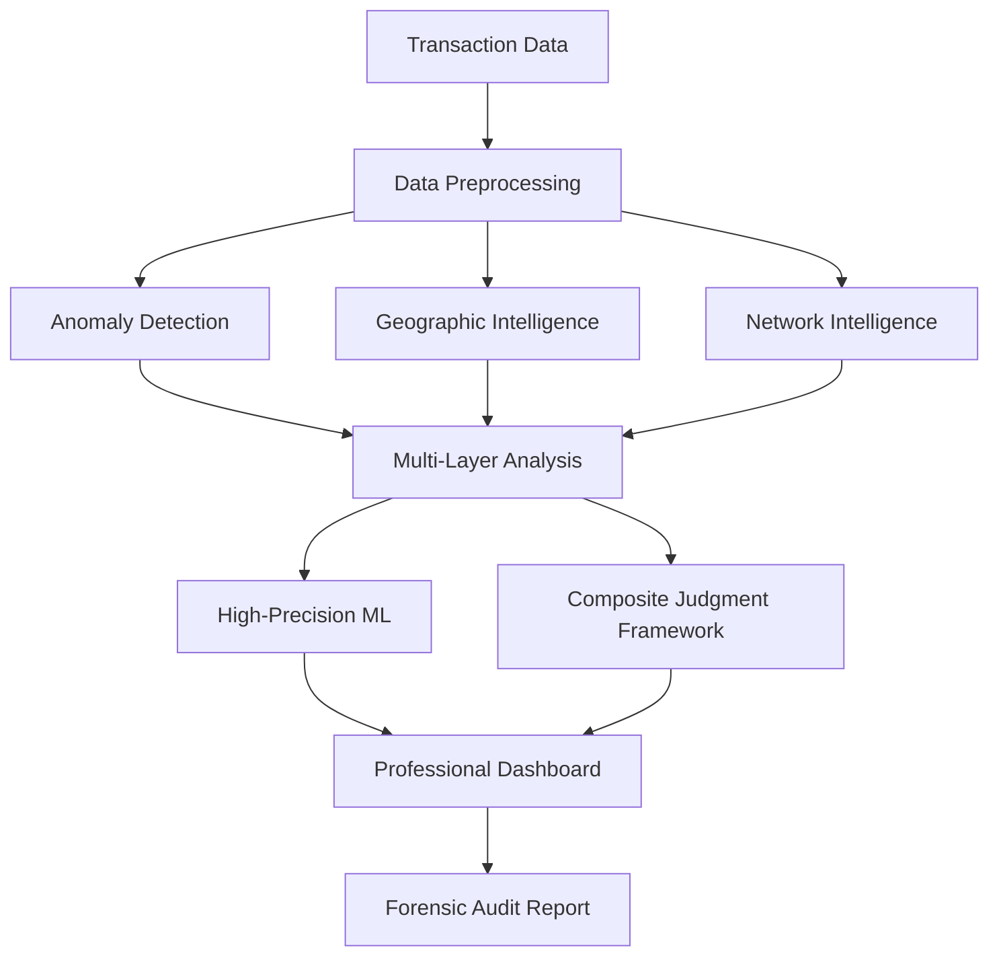
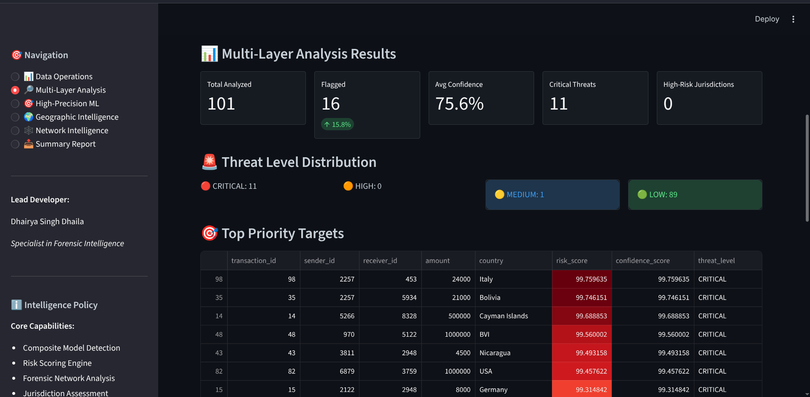
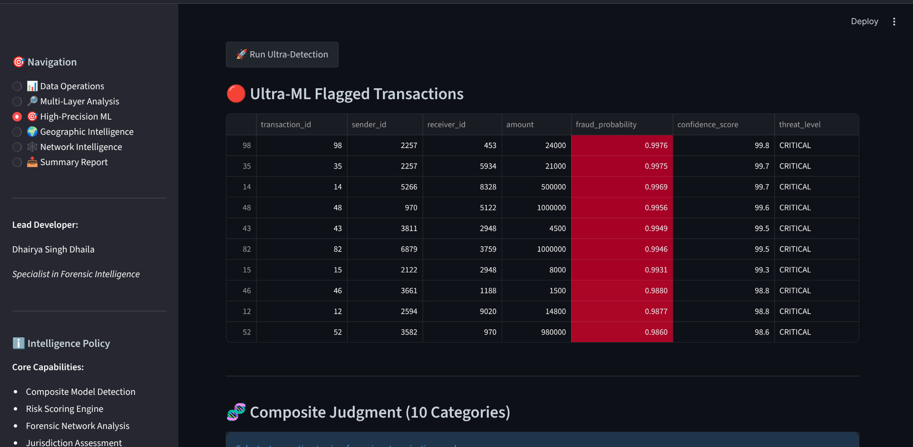
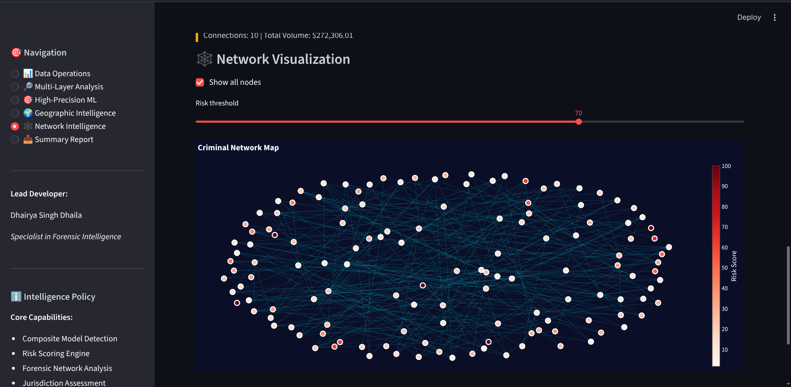
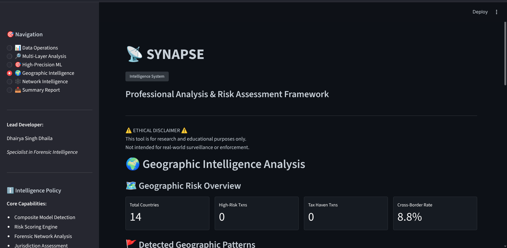

# SYNAPSE: Professional Intelligence Framework

**SYNAPSE** is a multi-layered risk analysis system designed for identifying and visualizing complex financial transaction patterns. It integrates statistical ensembles, jurisdictional risk profiling, and advanced network analytics into a professional forensic environment.

---

## 🏗️ System Architecture


**Professional transaction monitoring environment with real-time risk telemetry.**

SYNAPSE is built with a modular architecture to ensure transparency and scalability across different analysis domains.



### Core Modules
- **`main.py`**: The primary analyst dashboard using Streamlit.
- **`modules/data_preprocess.py`**: Handles data integrity, SHA-256 anonymization, and metadata simulation.
- **`modules/anomaly_detect.py`**: Baseline unsupervised detection using Isolation Forest.
- **`modules/advanced_ml.py`**: Multi-model ensemble engine (DBSCAN, Z-Score).
- **`modules/prediction_engine.py`**: High-precision supervised learning ensemble (XGBoost, LightGBM).
- **`modules/geographic_intel.py`**: Jurisdictional risk profiling and tax haven detection.
- **`modules/advanced_graph.py`**: Relationship intelligence, centrality, and community mapping.
- **`modules/criteria_engine.py`**: The "Composite Judgment" brain that evaluates transactions against 10 forensic layers.
- **`modules/report_generator.py`**: Generates structured forensic audit trails in JSON/CSV.
- **`test_validation.py`**: Multi-layer analytical validation suite.
- **`perf_benchmark.py`**: High-precision performance benchmarking script.

---

## 🧬 Analytical Methodology

### 1. Composite Judgment Framework

*Consolidated risk telemetry from 10 distinct analytical layers.*

Every transaction is evaluated against **10 distinct analytical layers** to generate a comprehensive risk profile:
- **Transactional Behavior**: Volumetric spikes and round-figure thresholds.
- **Geographic Risk**: Proximity to high-risk hubs or concealment zones.
- **Temporal Patterns**: Night-time exfiltration or high-speed "burst" sequences.
- **Entity Relationships**: Network centrality and clustering with known high-risk entities.
- **Metadata Forensics**: Device fingerprint inconsistencies and auth failures.
- **Financial Consistency**: Deviations from declared economic profile/income.
- **Graph Topology**: Multi-hop layering paths and bipartite chains.
- **Internal Intelligence**: Cross-referencing against internal watchlists.
- **Statistical Models**: Multi-sigma deviations and distribution outliers.
- **Contextual Indicators**: Behavioral cues and procedural inconsistencies.

### 2. High-Precision ML Ensemble

*Validated fraud probability flags across the ensemble pipeline.*

The system utilizes a supervised ensemble (XGBoost + LightGBM + Random Forest) optimized via **Statistical Consensus**. This ensures that flags are not just anomalies, but validated indicators with a high probability of relevance.

### 3. Forensic Network Analytics

*Real-time graph analysis identifying layering paths and circular flows.*

Using **NetworkX**, SYNAPSE identifies:
- **Circular Flows**: Potential money-laundering "loops."
- **Layering Schemes**: Multi-hop paths designed to hide fund origins.
- **Community Clusters**: Sub-groups of accounts acting in coordination.

---

## 🌍 Geographic Intelligence

*Jurisdictional risk mapping and tax haven proximity analysis.*

SYNAPSE tracks funds across borders to identify transfers involving high-risk concealment zones, offshore tax havens, and sanctioned jurisdictions.

---

## 🚀 Operational Workflow

1. **Ingestion**: Upload CSV transaction data via the **Data Operations** section.
2. **Multi-Layer Analysis**: Execute the core intelligence engine to process statistical, geographic, and network signals.
3. **ML Training**: Navigate to the **High-Precision ML** section to train the predictive model on the current dataset consensus.
4. **Forensic Review**: Use the **Judgment Profile** (Radar Chart) to investigate specific flags.
5. **Audit Export**: Download a comprehensive JSON case file for external reporting.

---

## 🛠️ Installation & Setup

### Environment Requirements
- Python 3.9+
- Virtual Environment (recommended)

### Installation
```bash
# Clone the repository
git clone https://github.com/Ch4lkP0wd3r/SYNAPSE
cd SYNAPSE

# Set up the environment
chmod +x setup.sh
./setup.sh
```

### Launching the System
```bash
# Run the professional dashboard
./run.sh
```

---

## 🛡️ Analytical Governance & Ethics

> [!IMPORTANT]
> **Accountability & Privacy**
>
> SYNAPSE is designed with a "Privacy-First" approach:
> - **Anonymization**: All personally identifiable information (PII) is hashed using SHA-256.
> - **Explainability**: Risk scores are accompanied by objective forensic narratives ("Whys").
> - **Scope**: Validated for research and educational utility using synthetic datasets.

## ⚙️ Detailed System Working

### 1. Data Ingestion & Anonymization
When a CSV is uploaded, `data_preprocess.py` performs **SHA-256 hashing** on entity identifiers. This ensures that even high-risk flags do not expose sensitive personal data. It also simulates metadata (Device ID, IP, KYC status) to provide a rich forensic context for the analysis engines.

### 2. Multi-Layer Intelligence Pass
The system executes a parallel analysis across three core domains:
- **Statistical**: Calculates Z-scores and volatility.
- **Geographic**: Maps coordinates to jurisdiction risk indices.
- **Network**: Builds a graph to identify hubs and layering paths.

### 3. The Composite Judgment Phase
The `criteria_engine.py` acts as the "expert system." It takes the outputs from the multi-layer pass and applies 200+ specific risk indicators.
- **Narratives**: For every indicator triggered, a human-readable explanation is generated.
- **Tactics**: The engine interprets the pattern to predict the underlying operational tactic (e.g., "Structuring," "Rapid Exfiltration").

### 4. High-Precision ML Refinement
The `prediction_engine.py` uses the results of the initial detection passes as "statistical guidance" to train a supervised ensemble. This second pass reduces false positives and assigns a **Fraud Probability** score based on multi-model agreement (XGBoost, LightGBM, RF).

---
**Developer: Dhairya Singh Dhaila**  
*SYNAPSE Intelligence Framework v3.1.0*
